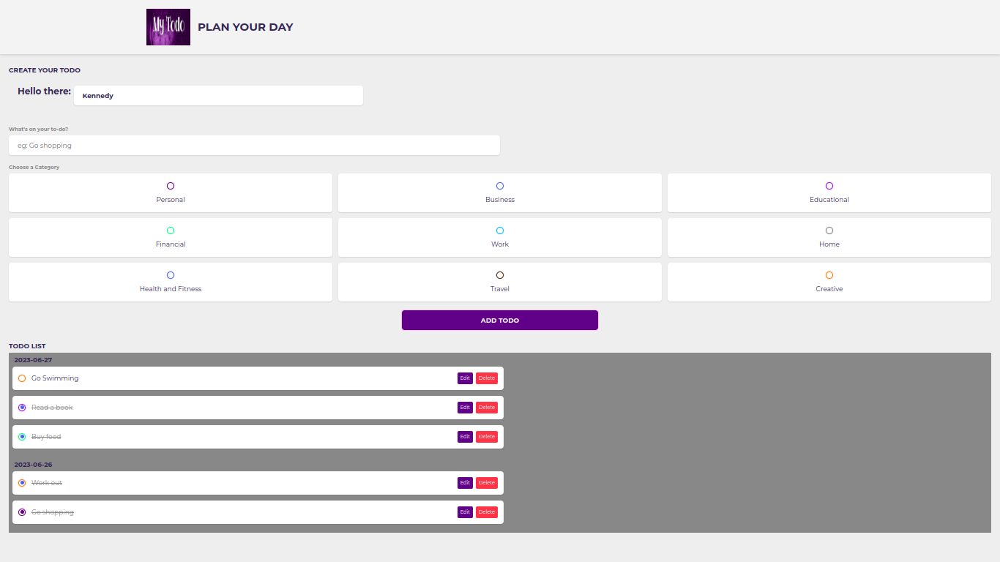

# TODO APP in NodeJS

To install the packages run

    npm install

To run the application run this command on port 8000

    npm start

    or

    npm run dev

The project is a TODO application that impliments a drag and drop feature to update the order of tasks.

The project allows one to Update and Delete a created task and Mark it as done.

By default, the application assigns the user name "Kennedy" as the owner.

However, you have can personalize the application by changing "Kennedy" to your preferred name, which will set you up as the owner.

